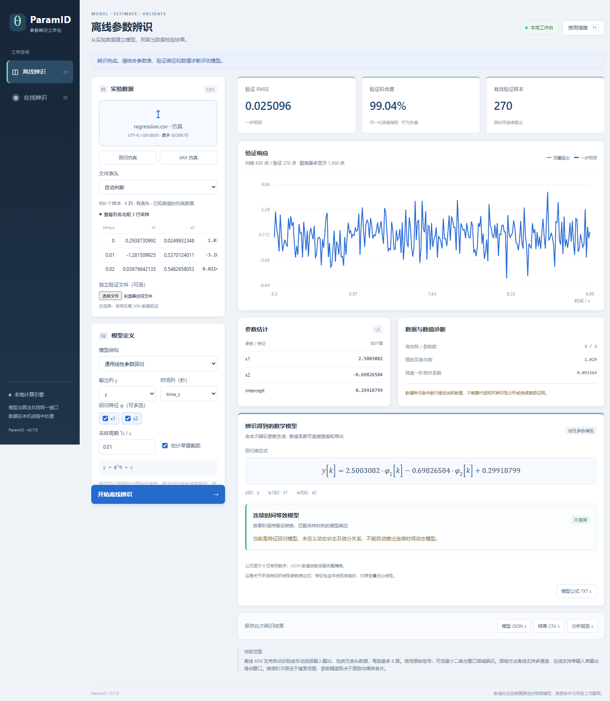

# ParamID · 参数辨识工作台

面向线性系统的本地参数辨识工具，支持离线建模、在线采集、自动定阶和数学模型导出。Windows 桌面版提供独立软件窗口，无需手动打开浏览器或启动服务。



## 已有功能

| 场景 | 功能 |
| --- | --- |
| 离线回归 | 普通最小二乘、加权最小二乘、岭回归；权重留空按普通最小二乘计算 |
| 离线动态系统 | ARX 自动选阶；多输入多输出联合 ARX + 输出误差（OE）精修 |
| 窗口频域辨识 | Welch 分窗平均、H1 频响估计、有理传递函数拟合；离线支持多输入多输出 |
| 在线辨识 | RLS / 遗忘因子 RLS，或滑动窗口频域辨识；动态系统当前为单输入单输出 |
| 数据接入 | CSV / TSV、串口文本或二进制、文件跟随、仿真源、HTTP / 文件回放 |
| 二进制解码 | float64（double）、float32、整数等预设；字节序、帧结构及受限表达式解码 |
| 通道识别 | 自动识别 `input1,input2,…` / `output1,output2,…`；无表头可手动映射 |
| 结果 | 验证曲线、离散传递函数、状态空间、可转换时的 ZOH 连续等效模型、JSON / CSV / 报告导出 |

自动选阶是在有限候选范围内根据选模数据选择结构，并不保证恢复真实物理阶数。连续模型来自离散模型的零阶保持等效转换，并非独立连续时间辨识。算法条件见[使用说明](docs/user-guide.md)和[窗口频域说明](docs/frequency.md)。

建议使用能覆盖对象动态的脉冲、PRBS 或多正弦激励，保留完整响应；多输入需要独立的有效激励。示例均为生成的仿真数据。

## 从源码启动桌面软件

环境：Windows 10 / 11 x64、Python 3.10–3.12、Microsoft Edge WebView2 Runtime。桌面界面由 pywebview / WebView2 承载 HTML/CSS，Python 服务仅监听本机回环地址，端口自动分配。

解压源码或克隆仓库后，在项目根目录打开 PowerShell：

```powershell
python -m venv .venv
.\.venv\Scripts\python.exe -m pip install -r requirements-desktop.txt
.\.venv\Scripts\python.exe desktop.py
```

依赖安装完成后，也可双击根目录的 `启动软件.cmd`。首次体验可点击“回归仿真”或“ARX 仿真”，或导入 `examples/multichannel.csv`。

桌面实验文件位于 `%LOCALAPPDATA%\ParamID`，可通过环境变量 `PARAMID_DATA_DIR` 改为独立目录。安装包如已由维护者发布，可从仓库 Releases 下载；源码仓库本身不携带 EXE 或 Python 环境。

仅调试计算服务时，可安装 `requirements.txt` 后运行 `python app.py --port 8770`，再访问控制台打印的本机地址。计算核心也可在 Linux 上使用；桌面安装包面向 Windows。

## 测试

```powershell
.\.venv\Scripts\python.exe -m unittest discover -s tests -q
.\.venv\Scripts\python.exe desktop.py --self-test
```

界面端到端检查还需要 Node.js 22+ 及 Chrome / Edge，无需安装 npm 包：

```powershell
node scripts/ui_smoke.mjs
```

脚本优先使用项目 `.venv`，也可用 `PARAMID_PYTHON` 指定 Python、`PARAMID_BROWSER` 指定浏览器程序。测试使用独立浏览器配置，截图及临时结果写入被 Git 忽略的 `outputs/`。

更多仿真验证：`python scripts/validate_frequency.py`。项目提供 GitHub Actions 核心测试和界面检查；上传后可在 Actions 中查看实际运行结果。

## 构建 Windows 发布包

```powershell
.\scripts\build_windows.ps1 -Python .\.venv\Scripts\python.exe -SkipInstall
```

生成 `release/ParamID-Portable.zip`；本机安装 Inno Setup 6 后，同时生成 `release/ParamID-Setup-0.7.0.exe`。可用 `-InnoCompiler` 指定编译器位置。细节见[桌面构建说明](docs/desktop.md)。

`requirements.txt` / `requirements-desktop.txt` 定义兼容范围；`requirements-tested.txt` 记录本地验证过的直接依赖版本，并非完整依赖锁文件。GitHub Actions 的 **Build Windows** 工作流可手动生成构建附件，不会自动发布 Release。

## 项目结构

```text
ParamID/
├── desktop.py              # Windows 桌面入口
├── app.py                  # 本机 HTTP 接口
├── paramid/                # 算法、定阶、模型表示、采集与解码
├── web/                    # 桌面界面资源，无前端构建依赖
├── examples/               # 仿真 CSV、配置与模型真值
├── tests/                  # 数值、协议、会话及导入测试
├── scripts/                # 示例、验证、构建与源码打包
├── installer/              # Windows 安装器配置
├── docs/                   # 使用与算法文档
└── .github/                # 自动检查、构建工作流与反馈模板
```

## 文档

- [使用与算法说明](docs/user-guide.md)
- [窗口频域辨识](docs/frequency.md) · [多通道辨识](docs/multichannel.md)
- [二进制解码](docs/binary-decoder.md)
- [桌面运行与打包](docs/desktop.md)
- [上传 GitHub 与发布版本](docs/github.md)
- [开发与贡献](CONTRIBUTING.md) · [变更记录](CHANGELOG.md)

## 许可证

项目原创代码采用 [MIT License](LICENSE)。第三方依赖保持各自许可证，见 [THIRD_PARTY_NOTICES.md](THIRD_PARTY_NOTICES.md)。
