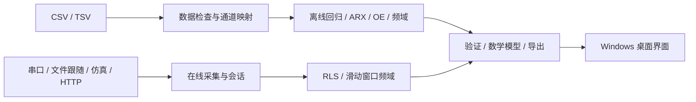

# 架构与能力边界

## 运行结构

Windows 桌面入口 `desktop.py` 使用 pywebview / WebView2 创建独立窗口，并在系统分配的本机端口启动 `app.py`。网页资源全部来自项目 `web/`，不需要前端打包工具或外部 CDN。浏览器模式仅用于开发调试。

## 模块

| 文件 | 职责 |
| --- | --- |
| `app.py` | HTTP 路由、请求检查、静态资源与结果下载 |
| `desktop.py` | 桌面窗口、服务生命周期、当前用户数据目录 |
| `paramid/data.py` | 文本表格、列映射与数据检查 |
| `paramid/core.py` | 线性参数模型、批量估计与 RLS |
| `paramid/selection.py` | SISO ARX 候选结构选择 |
| `paramid/multichannel.py` | 多输入联合 ARX 与输出误差精修 |
| `paramid/frequency.py` | Welch 谱估计与频域有理模型拟合 |
| `paramid/frequency_session.py` | 因果滑动窗口频域会话 |
| `paramid/service.py` | 离线任务、在线会话及结果组织 |
| `paramid/acquisition.py` | 数据源、接收/估计线程、记录与设备模板 |
| `paramid/decoder.py` | 二进制帧、预设类型和受限表达式解码 |
| `paramid/representation.py` | 差分方程、传递函数、状态空间与文本 |
| `paramid/continuous.py` | ZOH 连续等效转换与重新离散化核验 |

## 数值与数据语义

批量线性估计采用缩放与 SVD / QR 类求解，避免显式求正规方程的逆。输入无变化、通道共线、时间异常等问题应明确报告，不能将正则化后的数值结果视为已经证明可辨识。

离线单文件按时间划分训练、选模和最终验证；独立验证文件不参与选阶。具体比例、候选范围和目标函数见 [使用说明](user-guide.md)、[多通道说明](multichannel.md)及[频域说明](frequency.md)。

在线估计只使用已接收数据。RLS 与窗口频域均先进行初始结构选择，然后固定结构更新系数；不在每个采样点重新搜索阶数。在线一步预测使用更新前的模型，不能等同于独立验证上的自由运行误差。

采集与计算、界面刷新解耦。接收队列有容量限制，实验数据增量写盘；停止采集时关闭生产者、处理已接受样本并生成归档。高级会话曲线的内存历史有上限，不能替代完整采集记录。

## 模型边界

- 离线动态模型支持多输入多输出；在线动态会话为单输入单输出。
- 当前主要面向线性系统；没有通用非线性灰箱、N4SID、EKF / UKF 参数估计或硬实时嵌入式实现。
- 频域 H1 方法对准确输入、与输入不相关的输出测量噪声较合适；输入噪声、闭环相关噪声和非线性仍需其他建模方法。
- 连续模型是带零阶保持、对数分支与延迟约定的等效转换。转换失败保留离散结果；不能唯一恢复采样带宽以外的真实连续动态。
- 不包含输出低通或一阶差分预处理，也不自动插值缺失值或重采样。
- Python 桌面程序不提供硬实时保证。真实设备吞吐、调度延迟及丢包行为需要针对设备实测。

## 存储与发布

桌面运行数据默认存入 `%LOCALAPPDATA%\ParamID`；开发服务的默认输出位于项目 `outputs/`。用户可设置 `PARAMID_DATA_DIR` 使用独立目录。运行数据和构建结果由 `.gitignore` 排除。

源码 ZIP 由 `scripts/package_source.py` 按源码白名单生成；Windows 程序由 `scripts/build_windows.ps1` 构建，安装包单独发布到 GitHub Releases。
